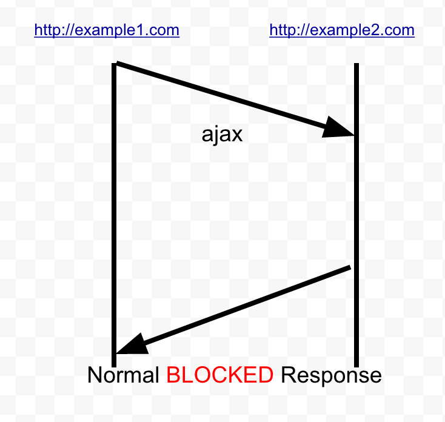

# CORS ( Cross Origin Source sharing)

CORS est une "technologie" qui permet d'assouplir le principe de "Same Origin Policy"
et de permettre la communication entre les sites web.

Principe de fontionnement de SOP:

<thead>
    <tr>
      <th>URL</th>
      <th>Résultat</th>
      <th>Motif</th>
    </tr>
  </thead>
  <tbody>
    <tr>
      <td><code>http://store.company.com/dir2/other.html</code></td>
      <td>Succès</td>
      <td></td>
    </tr>
    <tr>
      <td><code>http://store.company.com/dir/inner/another.html</code></td>
      <td>Succès</td>
      <td></td>
    </tr>
    <tr>
      <td><code>https://store.company.com/secure.html</code></td>
      <td>Échec</td>
      <td>Protocoles différents</td>
    </tr>
    <tr>
      <td><code>http://store.company.com:81/dir/etc.html</code></td>
      <td>Échec</td>
      <td>Ports différents</td>
    </tr>
    <tr>
      <td><code>http://news.company.com/dir/other.html</code></td>
      <td>Échec</td>
      <td>Hôtes différents</td>
    </tr>
  </tbody>
</table>

** la SOP n'empêche pas une requête d'être émise, mais seulement de consulter la réponse reçue du serveur lorsque la requête est émise depuis une origine différente.**

Certaines configurations CORS peuvent etre dangereuses
Websites enable CORS by sending the following HTTP response header:

Access-Control-Allow-Origin: https://example.com

Cette permission donné à "example.com" 
Cela permet à l'origine (domaine) listée de faire en sorte que les navigateurs web des visiteurs envoient des requêtes inter-domaines au serveur et lisent les réponses - 
Ce que la politique de la même origine devrait normalement empêcher. Par défaut, cette requête sera émise sans cookies ni autres informations d'identification, de sorte qu'elle ne peut pas être utilisée pour voler des informations sensibles spécifiques à l'utilisateur, comme les jetons CSRF. 

Le serveur peut activer la transmission des informations d'identification en utilisant l'en-tête suivant
Access-Control-Allow-Credentials: true
Cela crée une relation de confiance - une vulnérabilité XSS sur exemple.com est une mauvaise nouvelle pour ce site.

Access-Control-Allow-Origin: http://foo.com http://bar.net
--> Aucun navigateur ne supporte cette configuration

You might also want to use a wildcard to trust all your subdomains, by specifying something like:
Vous pourriez autoriser uniquement les sous domaines en specifiant *.domaine.com
Access-Control-Allow-Origin: **.portswigger.net
Ca ne marchera pas non plus. 

La pire configuration : ( exposition complete du site ) 

Access-Control-Allow-Origin: *
Access-Control-Allow-Credentials: true

# Principe d'une attaque CORS: 

# Methodologie pour pentesters

- voir si le serveur renvoie spontanément des en-têtes CORS ;
- voir si le serveur renvoie des en-têtes CORS lorsqu'on lui soumet des origines « plausibles » dans le contexte : son domaine, son domaine de second niveau, des domaines potentiellement partenaires...
- voir comment le serveur répond à des requêtes OPTIONS avec les mêmes variations que ci-dessus ;
    on essaiera dans tous les cas d'obtenir une origine autorisée que l'on maîtrise ou peut maîtriser ;
    si le serveur supporte plusieurs origines, on contrôlera qu'il renvoie bien un en-tête Vary: origin ;
    de plus dans le cas de réflexion d'origine ou de header, on essaiera d'exploiter ce comportement pour faire de l'injection de headers dans la réponse.

Les outils de scans de vulnerabilités traitent les cas de vulnerabilités CORS mais pas de maniere exhaustive 
Une recherche manuelle sera donc la bienvenue en complément par exemple du plugin Burp Backslash Powered Scanner

# Recommandations:

En cas de mauvaise configuration et/ou de vulnérabilité, les recommandations suivantes de configuration des CORS pourront être émises en les adaptant au contexte :

ne pas renvoyer d'en-tête CORS tant que le serveur n'a pas reçu de requête comportant un en-tête Origin: ;
proscrire l'origine null : refuser l'origine null et ne jamais renvoyer Access-Control-Allow-Origin: null ;
renvoyer des en-têtes CORS uniquement lorsque la réponse d'une ressource doit être accessible d'un script :
ne pas renvoyer Access-Control-Allow-Origin: *, sauf sur de vraies ressources publiques destinées à être consommées par des scripts (catalogue de produits par exemple) exécutés par un agent ;
lister les origines acceptées au sein d'une liste blanche et ne jamais renvoyer un en-tête Access-Control-Allow-Origin avec une valeur ne figurant pas dans la liste blanche ;
toujours renvoyer un en-tête Vary: origin si plusieurs origines distinctes sont autorisées ;
si l'origine reçue ne correspond à aucune origine de la liste blanche, renvoyer une erreur plutôt qu'un contenu sans en-tête Access-Control-Allow-Origin. Cela évite de divulguer du contenu potentiellement sensible, même si l'agent ne permettrait pas au script demandeur d'y accéder ;
renvoyer Access-Control-Allow-Credentials: true uniquement lorsque la réponse d'une ressource DOIT être accessible d'un script exécuté par un agent en mode authentifié.

