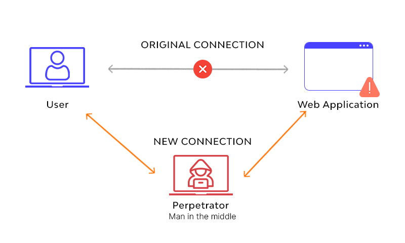
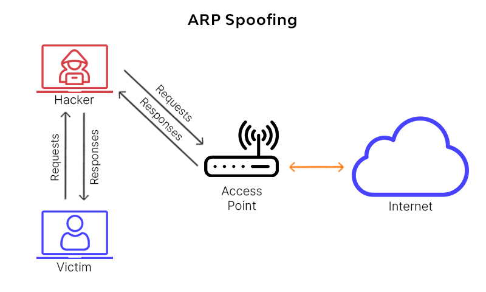
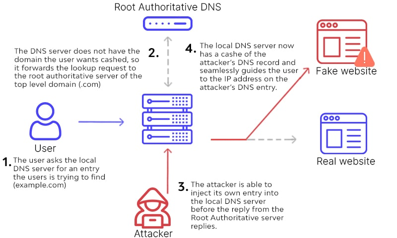

# Man in The Middle (attaque de l'homme du milieu) 

1. Principe

L'attaquant intercepte et altère la communication entre l'utilisateur et le serveur

Les attaques MITM peuvent affecter n'importe quel échange de communication, y compris les communications entre appareils et les objets connectés (IoT).

2 categories:
 - Active :

 L'attaquant empêche le client initial de communiquer avec le serveur et se replace ensuite dans la session.

 À partir de ce moment, l'attaquant communique avec le serveur et peut faire tout ce qu'un utilisateur normal peut faire.

 Il peut altérer les données ou collecter des informations sensibles susceptibles d'avoir un impact ultérieur.

 - Passive 

 L'attaquant surveille les données qui circulent sur le réseau sans interrompre la communication proprement dite. 
 L'intrus écoute la communication mais ne modifie en rien le flux de messages. Il peut collecter toutes les données qui passent par le réseau, ce qui peut entraîner une attaque active ultérieurement.

2. Techniques communes:

    a. Rogue Access Point (Point d'accès frauduleux)

    Dispositif/équipement installé sans autorisation qui est configuré pour tromper les utilisateurs qui se connecte automatiquement au wifi en se faisant passer pour des points d'accès public.

    b. Arp (Address Resolution protocol) spoofing

   ARP (Address Resolution Protocol) est un protocole de résolution d'adresses qui traduit les adresses MAC physiques de 40 bits en adresses IP logiques de 32 bits.
   Essentiellement, il traduit les adresses de la couche 3 du réseau en adresses de la couche 2 de  liaison de données.

   Protocole utilisé pour trouver l'adresse MAC à partir d'une adresse IP
   Chaque demande ou réponse ARP est fiable, il est donc possible d'envoyer des requêtes ( sur un domaine de collision/LAN) pour indiquer que l'attaquant est le routeur.

   Les clients peuvent accepter des réponses même s'ils n'ont pas envoyé de demande. 

Ex d'outil: arpspoof ( paquet dsniff de Debian) 

> arpspoof -i eth0 192.168.1.1 

Commande qui annonce aux clients du réseau que la machine qui émet cette requête est le routeur
Il faut également , forwarder tous les paquets vers le routeur réel sinon aucune machine n'est en mesure de communiquer à l'extérieur (réseau différent)  

L’utilisation de commutateurs de niveau 3, capables de gérer l’association MAC/IP/port est également une solution au problème.

Ou solution active : arpwatch : détecte les changements d'association adresses MAC/IP

Mesure de protection: HTTPS

Nota: arp spoofing ( usurpation d'une adresse mac ; ex 1 hote) / arp poisonning ( empoisonnement arp , à l'echelle d'un réseau) 

   c. DNS spoofing ( Usurpation de DNS) ou DNS Cache poisonning ( empoisonnement du cache DNS)
    
   Même principe que l'arp spoofing 
   L'usurpation de DNS consiste à remplacer les adresses IP stockées dans le serveur DNS par des adresses sous le contrôle de l'attaquant. 
   Ainsi, lorsqu'un utilisateur tente d'accéder à un site web particulier, il est dirigé vers le site web malveillant placé par l'attaquant dans le serveur DNS usurpé.

L'attaquant doit au préalable prendre le contrôle du "resolver" DNS (local)  en utilisant une faille de sécurité de l'équipement ou en récupérant les identifiants ( Box, serveur, routeur, ...) 

Mesure corrective:

Changer régulièrement le mot de passe du routeur ( si le routeur fait la résolution DNS) 
Utilisation de DNSSEC

__Tips__: 

Vider le cache DNS régulièrement :

Windows : ipconfig /flushdns

Linux : systemd-resolve --flush-caches

Chrome: chrome://net-internals/#dns

    d. Email Hijacking 

    e. ICMP Redirection

    f. DHCP spoofing

    g. SSL stripping

Mesure corrective ou prevention:

- Ne pas utiliser les réseaux public(utilisation de VPN non gratuit) , 
- Utiliser ( forcer )  HTTPS
- Changer régulièrement les mots de passe  des AP wifi et routeur
- restreindre le réseau local au seul machine autorisés
- DNSSEC

