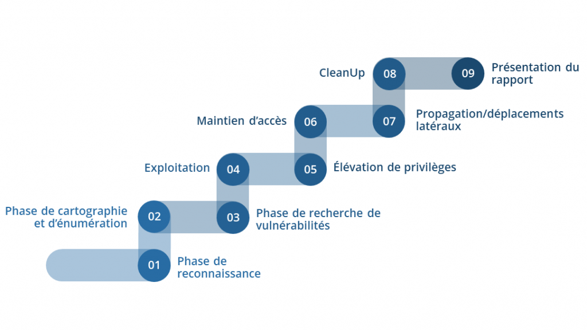
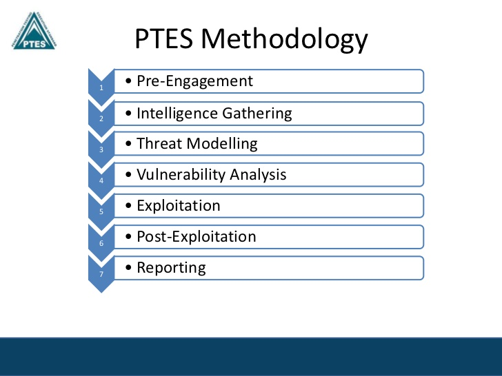

# Pentest (test d'intrusion)

## Quelques chiffres (En constante augmentation) 

- Une entreprise française sur 2 est victime d'une cyberattaque
- 287 jours  en moyenne sont nécessaire aux équipes de sécurité pour identifier une fuite de données
- Augmentation de 50% en 2021 comparé à 2020, avec un pic en décembre, principalement du à l'exploitation de la faille Log4j
- Plus de 450,000 nouveaux cas de malware sont découverts chaque jour.
- Parmi les victimes de ransomware, 32% paient la rançon mais seulement 65% des données sont récupérées
- 2 attaques par jour contre les établissements de santé en 2021
- Le coût moyen d’une donnée volée s’élève à 144€ (ex: Données médicales -> 200€ / Carte bancaire -> 1€)

## Raisons pour réaliser un pentest:

- Etre accompagné par un professionnel
- Apporter la preuve que la solution (application, site internet, hebergement, etc ...) est sécurisée
- Preparation d'une nouvelle certification ou renouvellement (ISO27001, SOC2, PCI-DSS, Critères communs …)
- Conformité reglementaire (LPM/NIS, DORA,reglementation du secteur)
- Sensibiliser ou tester ses équipes

## Presentation et méthodologie

- Pentest ou test d'intrusion est une technique de piratage éthique consistant à tester les vulnérabilités d’un système informatique, d’une application ou d’un site web en détectant les failles susceptibles d’être exploitées par un hacker ou un logiciel malveillant.
- Il se materialise généralement par un rapport final à plusieurs niveaux de lecture (management, opérationnel) 
- Peut être réalisé de manière automatique ou manuellement par une société externe (ou équipe interne) 

Difference test d'intrusion (pentest) avec un audit de sécurité ? 

## Objectifs

-  Lister un ensemble d’informations, trouvées d’une manière ou d’une autre, et qui peuvent être sensibles ou critiques
-  Dresser une liste des vulnérabilités ou faiblesses du système de sécurité pouvant être exploitées
-  Démontrer qu’un attaquant potentiel est en capacité de trouver des vulnérabilités et de les exploiter pour s’introduire dans le système d’information.
-  Tester l’efficacité des systèmes de détection d’intrusion et la réactivité de l’équipe de sécurité, et parfois des utilisateurs (social engineering)
-  Effectuer un reporting et une présentation finale de ses découvertes au client
-  Donner des pistes et conseiller sur les méthodes de résolution et de correction des vulnérabilités découvertes.

## Types de pentest 

- Boite noire (black box) 

- Boite blanche (white box) 

- Mixte (grey box) ? 

## Préparation d'un pentest

-  Périmètre 

-  Autorisation / interlocuteurs / documents

## Périmètre

- Application Web 
- Mobile
- API
- Desktop (executables/binaires)
- Infrastructure (Interne / Externe )
- Autres (ATM, hardware, IOT, etc )

## Autorisation 

Le « mandat d'autorisation de test de pénétration » doit être signé par le représentant légal de l’entreprise ou le responsable des systèmes d’informations.

**Article 509-1 du Code pénal :** 

« Quiconque, frauduleusement, aura accédé ou se sera maintenu dans tout ou partie d’un système de traitement ou de transmission automatisée de données sera puni d’un emprisonnement de deux mois à deux ans et d’une amende de 500 euros à 25 000 euros ou de l’une de ces deux peines ».

## Interlocuteurs 

- Responsable légal de l'entreprise 
- Administrateurs / responsable d'application 
- Equipe de surveillance
- Equipe de sécurité 
- ...

## Documents/reporting

- Document de préparation ( @IP , serveurs , application etc ...)
- Mandat d'autorisation
- Rapport final
- Préconisation d'amélioration

## Méthodologies (officiel)

-  PTES (Penetration Testing Execution Standard)

   [http://www.pentest-standard.org/index.php/PTES_Technical_Guidelines]( http://www.pentest-standard.org/index.php/PTES_Technical_Guidelines)

-  OWASP Testing Guide

    [https://owasp.org/www-project-web-security-testing-guide/stable/](https://owasp.org/www-project-web-security-testing-guide/stable/)

-  OSSTM (Open Source Security Testing Methodology Manual)

    [http://www.isecom.org/OSSTMM.3.pdf](http://www.isecom.org/OSSTMM.3.pdf)

-  Technical Guide to Information Security Testing and Assessment

    [http://csrc.nist.gov/publications/nistpubs/800-115/SP800-115.pdf](http://csrc.nist.gov/publications/nistpubs/800-115/SP800-115.pdf)

## Organisations qui développent et fournissent des guides et manuels

#### OSSTMM (Open Source Security Testing Methodology Manual)

Manuel de test et d'analyse sécurité créée par Pete Herzog et fournit par ISECOM.

Il inclut les tests de sécurité, l'analyse, les métriques de sécurité opérationnelles, l'analyse des risques,
les indicateurs de risque et les tactiques essentielles de test sécurité. 

#### ISSAF(Information Systems Security Assessment Framework) 

Framework ISSAF en constante évolution qui permet de modéliser les pré-requis de contrôle internes. 

Le principal apport du framework est de créer des liens distinct entre les taches d'un pentest et les outils.

## Organisation qui développent et fournissent des guides et manuels (suite)

#### OWASP (Open Web Application Security Project).

Organisation à but non commercial (licence libre et open-source) qui oeuvre à l'amélioration de la sécurité des applications.

Son objectif est de créer des standards ouverts et adaptables à des technologies orientées Web

#### PTES (Penetration Testing Execution Standard )

Guide technique qui définit les procedures à suivre et appliquer pendant un test d'intrusion.

Structure de base pour la conduite des tests de sécurité.

#### NIST (National Institute of Standards and Technology).

Base documentaire qui fournit les aspects techniques d'un audit de sécurité.

Fournit les tests techniques et les méthodes d'analyse qu'une organisation devrait utiliser pour effectuer un audit sécurité interne, ainsi que ces impacts sur les systèmes et réseaux.

## Etapes d'un pentest 

## Etapes d'un pentest (simplifié)

## Phase de reconnaissance 

- Exercice

Quels sont les 2 __méthodes__ et cités quelques __outils__ ?  (10 min) 

## Phase de cartographie et de reconnaissance

**Objectif:** 
 Inventorier et cartographier précisément l’ensemble des actifs du SI cible.

   Cette étape permet de se concentrer sur les éléments jugés critiques et sensibles.

**Méthode: Passive et Active**

**Exemples d'outils:**

    - Méthode passive: Base Whois,dig/nslookup, google, shodan (moteur de recherche),...   
	- Méthode active : Nmap, Nessus ou OpenVas

## Phase de recherche de vulnérabilités 

- Analyse des faiblesses (automatique ou manuelle) 

[Top 10 OWASP](https://owasp.org/www-project-top-ten/)

[CVEdetails.com ](https://www.cvedetails.com/)

**Exemples d'outils:** 

- Outils pour les applications web : BurpSuite, ZAP, nikto 

## Phase d'exploitation

**Objectifs:**

- Mise en application de la phase précédente

- Intrusion sur le SI cible

**Exemple d'outils:** 

- Metasploit

- Exploit-db.com/ searchsploit
	
## Elevation de privilèges

**Objectifs:** 

- Obtenir de nouveaux privilèges
- Accéder à des repertoires ou données sensibles

Dépend des connaissances et du savoir faire de l'auditeur 

## Maintien des accès

**Objectif:**

- Maintenir les accès privilégiés obtenu dans l'étape précédente pour se reconnecter et poursuivre la suite du test

Opérations à réaliser de manière furtive pour éviter d'éveiller des soupçons des équipes techniques

## Propagation/déplacement latéraux

**Objectif:** 

- Etendre la compromission à d'autres systèmes du périmètre cible 
	
**Exemple d'outil:**

- Empire 
- Mimikatz

## Nettoyage des traces

**Objectif:** 
Rendre le/les systèmes dans son état d'origine 

## Contenu du rapport de test

- Le contexte et le périmètre (exemple: les adresses IP qui ont été testées.)

- Les conditions du test : boîte noire, boîte grise, boîte blanche

- La méthodologie : OWASP, PCI, Penetration Testing Execution Standard, OSSTMM, etc…).
À défaut, il faut indiquer le processus de test qui a été suivi.

- Les axes d’évaluation : Les 3 axes d'évaluation utilisés pour qualifier les vulnérabilités ne sont pas forcément intuitifs.
Il est bon de les expliquer pour que le lecteur comprenne plus facilement.

- Les résultats du test : Généralement sous forme de tableau, il est présenté comme un listing des vulnérabilités trouvées, avec les différentes informations les qualifiantes.

## Contenu du rapport de test (suite)

- Une synthèse :

Synthèse récapitulant le nombre de vulnérabilités trouvées suivant :

- La sévérité
- Le niveau de priorité de correction
- La difficulté de correction

[https://owasp.org/www-community/OWASP_Risk_Rating_Methodology](https://owasp.org/www-community/OWASP_Risk_Rating_Methodology)

## Résumé 

- Document technique mais lisible par des non-informaticiens
- Un rapport de test est **confidentiel**
- Pas de structure unique  mais doit contenir des éléments indispensables

## Exemple de rapport de test de vulnérabilité

[Demo ?](images/exemple_rapport3.pdf) 

## Et après ?

Recommandations après le pentest et le rapport final:

- Ne pas dissimuler les résultats du test d’intrusion : il est important de partager le reporting en bonne intelligence avec les équipes internes, la direction et les sous-traitants.
- Inscrire le plan d’action dans la roadmap de la DSI.
- Planifier un test post-audit (re-test)  ciblé sur les vulnérabilités les plus critiques et les plus exposées, après remédiation.
- Un test d'intrusion doit être réalisé au moins une fois par an.

## Limites

- Test limité dans le temps
- Focus sur des vulnérabilités les plus simples et accessibles ( dans le temps imparti )
- Ne couvre qu'une partie du SI 

## Evolution 

- Discipline amenée à évoluer avec les technologies issues de l'IA (et BigData) 
L'adoption des techniques d'IA/ML, des analyses sécurité et du chiffrement ont permis de réduire les couts des failles (entre 1.25M$ et 1.49M$ ) comparativement aux entreprises qui n'en font pas un usage significatif.

- Outils de reconnaissance avancés et d'exploitation des vulnérabilités

Valeur ajoutée de l'humain :

- Trouver des solutions "originales" de détection des vulnérabilités.
- Capacité à produire des rapports et des recommandations personnalisées

## Quelques exemples de sites pour vous entrainer

[https://www.vulnhub.com/](https://www.vulnhub.com/)

[https://www.root-me.org/](https://www.root-me.org/)

[https://www.hackthebox.eu/](https://www.hackthebox.eu/)

[https://tryhackme.com/](https://tryhackme.com/)
...

## Bug Bounty (BB)

## Principe et objectif:

Une entreprise met à disposition de chercheurs en sécurité (hunters) leur système d'information (Web, API, apk ,...) dans le but de trouver des failles de sécurité en échange d'une rémunération

## Difference Pentest vs Bug Bounty 

- Dépend du besoin du client 
- Pentest apporte plus de conformité et répond aux risques metiers
- Profondeur du test plus importante pour le BB et complétude pour le pentest

## Vision "pentester"

Exemples: 

- Outdated software
- weak/insecure method (TRACE)
- Cleartext (Telnet, http, etc)
- Ciphers and protocols
- Expired/invalid certificates
- basic authentication
- Brute forcing  / no CAPTCHA
- user account enumeration
- No lockout policy
- Cookies not expiring
- weak password policy
- cookie flags

## Vision (vulnérabilités qualifiantes) "hunter"

- Remote code execution (RCE)
- Local files access and manipulation (LFI, RFI, XXE, SSRF, XSPA)
- Code injections (HTML, JS, SQL, PHP, ...)
- Cross-Site Scripting (XSS)
- Cross-Site Requests Forgery (CSRF) with real security impact
- Open redirect
- Broken authentication & session management
- Insecure direct object references
- CORS with real security impact
- Horizontal and vertical privilege escalation

::: notes

This is my note.

## Une entreprise a-t-elle besoin d'un pentest 
If a company is wondering whether it should do a penetration test, I advise answering the following questions honestly. 
Start with simple yes/no answers.
Then, for every yes answer, the company should see if it can back up that answer with, “Yes, because of internal process/procedure/application XYZ, which is maintained by employee ABC”:

- Is there an up-to-date record of every IP address and DNS name on the network?
- Is there a routine patching program for all operating systems and third-party applications running on the network?
- Do we use a commercial vulnerability scan engine/vendor to perform routine scans of the network?
- Have we removed local administrator privileges on employee laptops?
- Do we require and enforce strong passwords on all accounts on all systems?
- Are we utilizing multi-factor authentication everywhere?
- If your company can’t answer a solid yes to all of these questions, then a decent penetration tester would probably have little to no trouble breaking in and finding your organization’s crown jewels. I’m not saying you absolutely shouldn’t buy a penetration test, just that you should expect painful results.

:::

## QCM Final (10-15 minutes)

Socrative student 

**SIERP1310**

