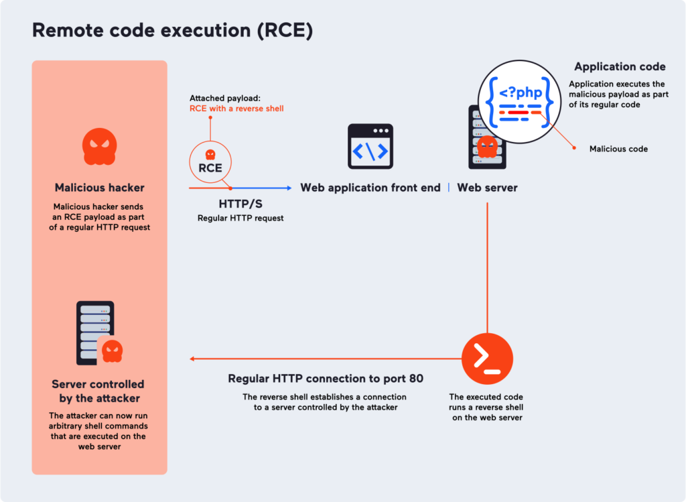

# RCE (Remote Code Execution ou Injection de code à distance) - "Code Injection" selon l'OWASP

Cette vulnérabilité permet d'executer du code à distance sur un systeme vulnérable en utilisant le language de l'application (PHP, javascript, java pour les applications Web,  C#, ...)  


D'autres vulnérabilités peuvent conduire à une exécution de code arbitraire à distance:
 - Buffer Overflow (dépassement de tampon)  dans des langages tels que C/C++ peuvent permettre à l'attaquant d'exécuter du code arbitraire dans l'application. 
 - Les vulnérabilités de désérialisation peuvent également permettre aux attaquants de fournir une charge utile qui, une fois désérialisée, comprend du code que l'application exécute. 
 - Des vulnérabilités d'injection SQL et de cross-site scripting (XSS) peuvent conduire à l'exécution de code à distance dans une application vulnérable. 
 
 
##### Exemple simple:
```php
<?php 
$command = $_GET['cmd'];
system($command);
?>
```
Ce code prend une entrée GET nommée "cmd" et l'utilise pour exécuter une commande système via la fonction PHP "system()". Si un attaquant envoie une requête GET avec une entrée de cmd malveillante, par exemple "http://example.com/script.php?cmd=cat%20/etc/passwd", l'attaquant peut exécuter n'importe quelle commande sur le serveur cible.

Pour PHP : Desactiver/analyser les fonctions eval(), system(), ou exec().


## Autres exemples de vulnérabilités RCE :

- CVE-2021-44228 (Log4Shell) in Apache Log4j 2.x (followed up by CVE-2021-45046 and a CVE-2021-45105 denial of service vulnerability)

- CVE-2019-8942 dans WordPress 5.0.0. Un attanquant peut executé du code arbitraire en deversant( upload)  une image manipulée contant du code PHP dans les metadata EXIF.

## Conséquences possibles des RCE:
 
 - Installation de WebShell: Ces payloads (même privileges que le serveur web) peuvent donner à l'attaquant un acces shell pour executer des commandes systèmes
 - Installatioin de reverse shell: Installation sur la cible d'un script/code qui va initier une connexion vers un serveur controlé par l'attaquant.Permet de passer les firewalls.

 Si l'attaque est réussi l'attaquant peut : 
 - Installer des ransomwares ou malwares
 - Installer des mineurs de cryptomonnaies
 - Récuperer des informations sensibles,réaliser des escalades de privilèges sur le système ou realiser des mouvements latéraux



## Reduire les risques des RCE :

- __Dans le cas d'une application personnalisé__

    - Eliminer du code de votre application les fonctions d'évaluation qui traitent les entrées contrôlées par l'utilisateur

    
- __Dans le cas d'une application tierce (commercial/opensource)__

    - Verifier les dernieres vulnerabilités et effectuer les mises à jouir avec la version qui corrige cette vulnerabilité (Généralement la derniere version)
    
    - Utilisation d'un WAF ( Web Application Firewall) ; solution temporaire permettant de rendre plus difficile l'exploitation RCE mais n'elimine par la cause du probleme
        
## Détecter les RCE :
 - Application commercial ou opensource :
     - Outils SCA (Software Composition Analysis) : Processus automatisé permettant d'identifier les logiciels tiers et open source (OSS) dans une base de code. 
     L'objectif de SCA est d'évaluer la qualité du code, la sécurité et la conformité aux licences.
Differents des outils SAST (Static Analysis Security Testing) / DAST (Dynamic Analysis Security Testing)
     
   Exemple d'outils:
   - Gitlab
   - Snyk (Free/licensing)
   - XRay (Jfrog)
      
   
- Utilisation de DAST (Dynamic Application Security Testing) 
