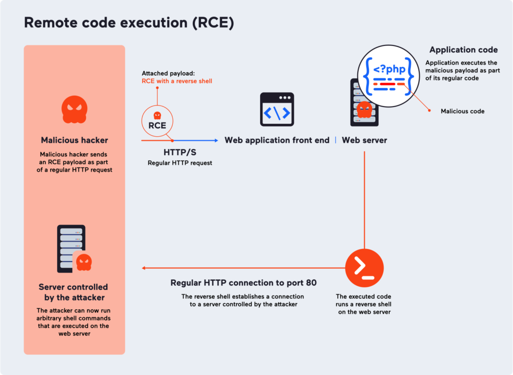

# RCE (Remote Code Execution ou Injection de code à distance) - "Code Injection" selon l'OWASP

Cette vulnérabilité permet d'executer du code à distance sur un système vulnérable en utilisant le language de l'application (PHP, javascript, java pour les applications Web,  C#, ...)  


D'autres vulnérabilités peuvent conduire à une exécution de code arbitraire à distance:
 - Buffer Overflow (dépassement de tampon)  dans des langages tels que C/C++ peuvent permettre à l'attaquant d'exécuter du code arbitraire dans l'application. 
 - Les vulnérabilités de désérialisation peuvent également permettre aux attaquants de fournir une charge utile qui, une fois désérialisée, est exécutée par l'application. 
 - Des vulnérabilités d'injection SQL et de cross-site scripting (XSS) peuvent conduire à l'exécution de code à distance dans une application vulnérable. 


## 3 types d'attaques RCE possible:

- Côté Serveur: 

 Injection dans une application web ou une base de données afin de l'exécuter sur un serveur.

 Ce type d'attaque vise les champs d'entrée de l'utilisateur, tels qu'un champ de recherche ou un formulaire de connexion. 
 Les applications qui ne valident pas correctement les entrées sont plus vulnérables à l'injection côté serveur.

- Côté client

Injection de code malveillant dans une application client, telle qu'un navigateur web. Cela se fait par le biais de publicités, de courriels ou de sites web malveillants qui exploitent les vulnérabilités du logiciel du client.

- Injection dans un shell: 

Code malveillant dans un shell où le serveur est en cours d'exécution.
Cela se fait par le biais de champs de saisie de l'utilisateur qui permettent l'exécution de commandes ou par le biais de vulnérabilités existantes dans le système d'exploitation ou les périphériques de réseau.

 
##### Exemple simple:
```php
<?php 
$command = $_GET['cmd'];
system($command);
?>
```
Ce code prend une entrée GET nommée "cmd" et l'utilise pour exécuter une commande système via la fonction PHP "system()". 
Si un attaquant envoie une requête GET avec une entrée de cmd malveillante, par exemple 

```php
http://example.com/script.php?cmd=cat%20/etc/passwd"
```

L'attaquant peut exécuter n'importe quelle commande sur le serveur cible.

Pour PHP : Désactiver/analyser les fonctions eval(), system(), ou exec().

#### Exemple 2 : 

Le formulaire de contact: 

```php
<?php
$username = $_POST['username'];
$password = $_POST['password'];

$query = "SELECT * FROM users WHERE username='$username' AND password='$password'";
$result = mysqli_query($conn, $query);

if (mysqli_num_rows($result) > 0) {
// login successful
} else {
// login failed
}
?>
```

```php
SELECT * FROM users WHERE username='''; system('rm -rf /'); //' AND password=''
```


## Autres exemples de vulnérabilités RCE :

- CVE-2021-44228 (Log4Shell) dans Apache Log4j 2.x (followed up by CVE-2021-45046 and a CVE-2021-45105 denial of service vulnerability)

- CVE-2019-8942 dans WordPress 5.0.0.
Un attaquant peut executé du code arbitraire en chargeant ( upload)  une image manipulée contant du code PHP dans les metadata EXIF.

## Conséquences possibles des RCE:
 
 - Installation de WebShell: Ces payloads (même privilèges que le serveur web) peuvent donner à l'attaquant un acces shell pour executer des commandes systèmes
 - Installation de reverse shell: Installation sur la cible d'un script/code qui va initier une connexion vers un serveur contrôlé par l'attaquant.Permet de passer les firewalls.

 Si l'attaque est réussi l'attaquant peut : 
 - Installer des ransomwares ou malwares
 - Installer des mineurs de cryptomonnaies
 - Récupérer des informations sensibles,réaliser des escalades de privilèges sur le système ou realiser des mouvements latéraux



## Reduire les risques des RCE :

- __Dans le cas d'une application personnalisé__

    - Eliminer du code de votre application les fonctions d'évaluation qui traitent les entrées contrôlées par l'utilisateur

    
- __Dans le cas d'une application tierce (commercial/opensource)__

    - Verifier les dernières vulnérabilités et effectuer les mises à jour avec la version qui corrige cette vulnérabilité (Généralement la dernière version)
    
    - Utilisation d'un WAF ( Web Application Firewall) ; solution temporaire permettant de rendre plus difficile l'exploitation RCE mais n'élimine par la cause du problème
        
## Détecter les RCE :
 - Application commercial ou opensource :
     - Outils SCA (Software Composition Analysis) : Processus automatisé permettant d'identifier les logiciels tiers et open source (OSS) dans une base de code. 
     L'objectif de SCA est d'évaluer la qualité du code, la sécurité et la conformité aux licences.
Differents des outils SAST (Static Analysis Security Testing) / DAST (Dynamic Analysis Security Testing)
     
   Exemple d'outils:
   - Gitlab
   - Snyk (Free/licensing)
   - XRay (Jfrog)
      
   
 - Utilisation de DAST (Dynamic Application Security Testing) 

   - Pentest dynamique sur la chaine de CI/CD 

   ex outils : ZAP ( scripting de scénario) 
