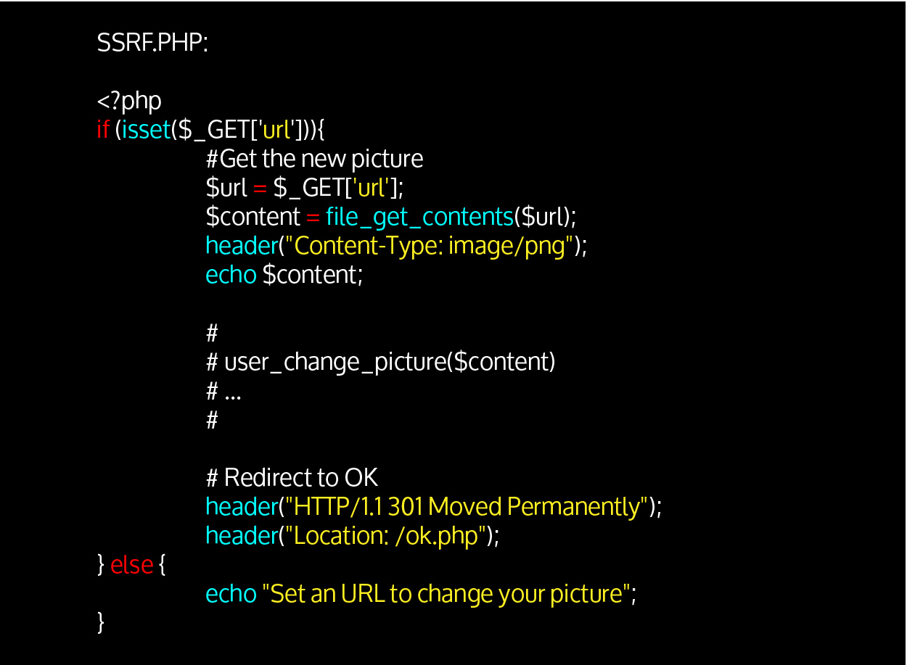

# Server-Side Request Forgery (SSRF)

Les SSRF permettent d’interagir avec le serveur, afin d’en extraire des fichiers et de trouver ses autres services actifs.
Il est egalement d'effectuer d'autres actions comme de scanner le reseau interne pour decouvrir les IP internes et les ports ouverts

Exemple de code vulnérable :

Exemple d'exploitation :

- Accès à une fonctionnalitée du serveur Apache (non exposée) :
http://vulnerable-serveur.com/ssrf.php?url=http://localhost/server-status

- Accès à un service web du serveur (non exposé) :
http://vulnerable-serveur.com/ssrf.php?url=http://localhost:8080

- Accès à un fichier du serveur (LFI : Local File Inclusion) :
http://vulnerable-serveur.com/ssrf.php?url=file:///etc/passwd

- Accès à un serveur web du réseau interne :
http://vulnerable-serveur.com/ssrf.php?url=http://10.0.0.15/

- Interface du routeur : http://vulnerable-serveur.com/ssrf.php?url=http://10.0.0.1/

D’autres exploitations peuvent être réalisées : XML External Entity (XXE), Cross-Site Scripting (XSS), injection de commande, etc.

C’est la fonction file_get_contents qui ouvre la brèche. Cependant, d’autres fonctions peuvent également en être la source, les plus classiques étant :

- file_get_contents()
- fopen()
- fread()
- fsockopen()
- curl_exec()

Ces fonctions vulnérables  ne se limitent pas à php mais peuvent se retrouver dans d'autres languages.

# Differents types de SSRF: 

- Content-Based: Le contenu de la ressource chargée est retourné par le serveur (echo $content;)
- Boolean-Based : la réponse du serveur est différente que la ressource existe ou non
- Error-Based : une erreur, HTTP (404 ou 500) par exemple, permettant de déduire les ressources existantes ou non
- Time-Based : dans le cas où la réponse du serveur reste la même que la ressource existe ou non, le temps de réponse peut quant à lui varier de manière significative

# Detection et exploitation 

### Outils d'exploitation semi-automatique: https://github.com/swisskyrepo/SSRFmap

### Evasion de filtre:

1. __Scanner le reseau interne:__

L’application pourrait cependant exiger que la valeur saisie soit un nom de domaine, et non une adresse IP, empêchant une exploitation de type « ?url=http://192.168.1.100 »

Une méthode simple de contournement est d’acheter n’importe quel domaine et d’ajouter l’enregistrement DNS vers l’IP voulu. Par exemple, on pourrait réaliser les enregistrements DNS suivants :

1.mon-domaine-de-test.com -> 192.168.1.1
2.mon-domaine-de-test.com -> 192.168.1.2
…
254.mon-domaine-de-test.com -> 192.168.1.254

On pourrait ensuite scanner le réseau avec : « ?url=http://100.mon-domaine-de-test.com ». 

--> Methode contraignante 

- Utilisation de la plateforme nip.io

Il suffit de saisir <IP-CIBLE>.nip.io : le serveur DNS va dynamiquement fournir l’adresse IP saisie comme IP correspondante. Par exemple : http://192.168.1.100.nip.io permettrait d’accéder à l’IP 192.168.1.100.

Si le filtre est un peu plus restrictif (pas de chiffres dans le sous-domaine par exemple), on peut ajouter n’importe quelles valeurs avant l’IP : http://this.bypass-filter.192.168.100.nip.io donne le même résultat que précédemment.
    
2. __Cibler le serveur vulnérable__
    
Une vérification peut etre faite sur le paramètre url vulnérable, ne permettant pas de saisir localhost ou 127.0.0.1.

Plusieurs méthodes peuvent permettre de contourner cette restriction et cibler le serveur :

- Utiliser NIP.IO mentionné précédemment : 127.0.0.1.nip.io
    
- Utiliser d’autres domaines prévus à cet effet : http://spoofed.burpcollaborator.net ou http://localtest.me (enregistrés à l’adresse 127.0.0.1)
    
- Utiliser des valeurs décimales : http://2130706433/ (= http://127.0.0.1)

Pour aller plus loin : 
    https://github.com/swisskyrepo/PayloadsAllTheThings

# Remédiation:

Mettre en place des regles sur les ressources chargées

- Les noms DNS et/ou adresses IP autorisées
En l’absence de localhost et 127.0.0.1, cela empêchera l’accès aux services/fichiers du serveur.
- L’accès illégitime au réseau interne sera empêché.
- Les protocoles autorisés
L’utilisation de file://, sftp://, sera alors empêché.
