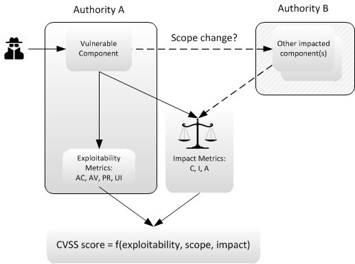
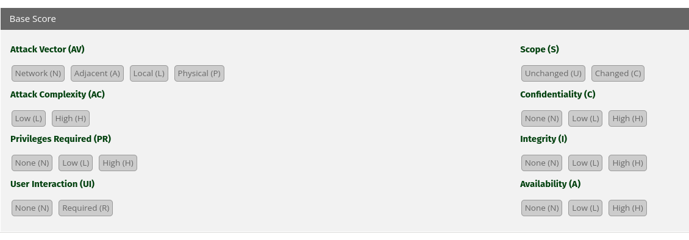
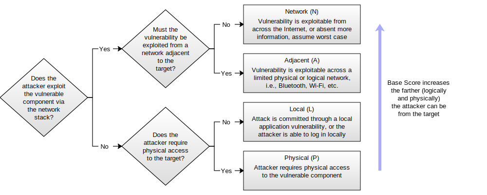
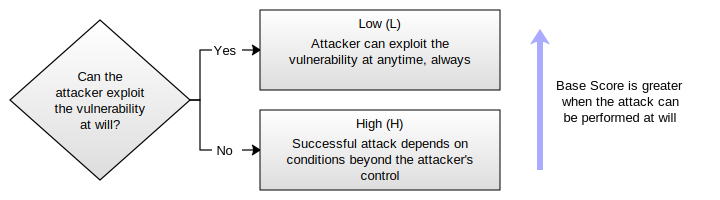
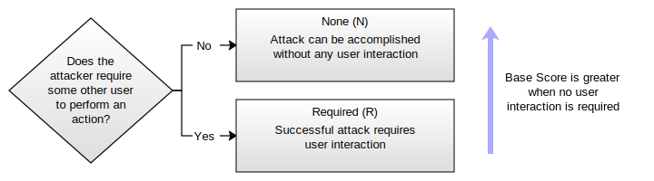
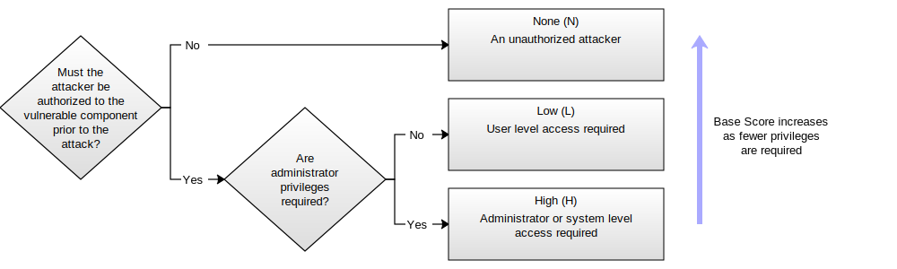
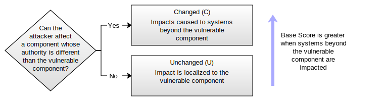
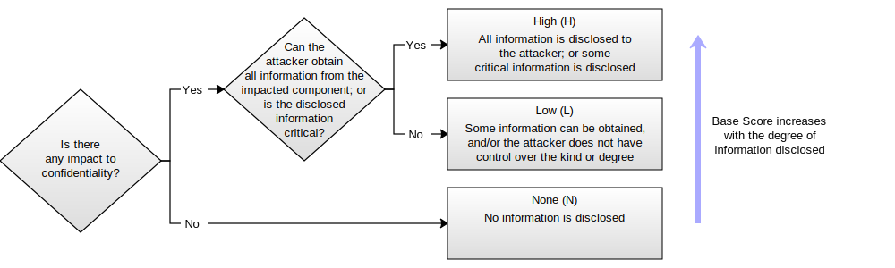
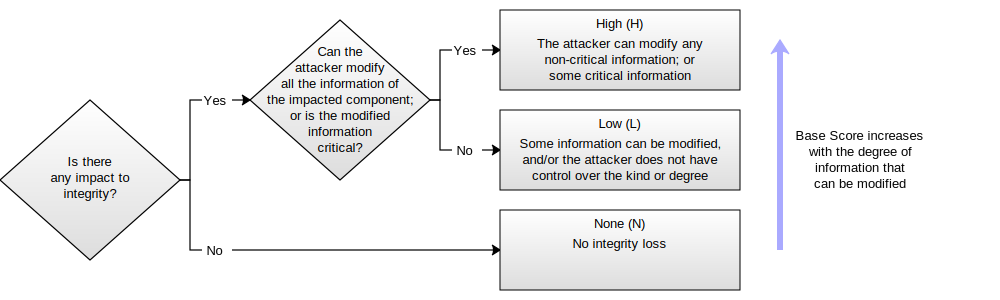

# CVSS (Common Vulnerability Scoring System)

CVSS est un framework public permettant d'évaluer la sévérité d'une vulnérabilité quelque soit l'éditeur de l'application.

# Historique

Le score CVSS a été crée en 2005 par NIAC (US National Infrastructure Assurance Council), puis reprit par l'organisation international Forum for Incident Response and Security Teams (FIRST).

Historiquement, chaque éditeur avait sa propre méthode de scoring. Il était difficile pour les administrateurs de prioriser les corrections.

L'objectif initial était d'adresser ce problème pour uniformiser simplement l'évaluation des vulnérabilités en fonction de la sévérité et l'impact sur un environnement IT spécifique

Cette organisation regroupe diverses entreprises et individus qui aide à promouvoir et améliorer le framework

# Version

CVSS2 en 2007 améliore la précédente version

CVSS3 en juin 2015 qui a apporté d'important changement pour refléter la réalité comme les privileges nécessaires à l'exploitation de la vulnérabilité.

CVSS 3.1 de juin 2019

# Métrique de vulnérabilités

-   Base score
-   Temporal score (optionnel)
-   Environnemental score (optionnel)

## Métrique de Base (Base metrics) (Obligatoire)

Définit les caractéristiques de la vulnérabilité, qui ne change pas au cours du temps, de l'environnement

Composé de 2 ensemble de métriques

### Métriques d'exploitabilité:

-   Attack vector (AV)
-   Attack complexity (AC)
-   Privileges required (PR)
-   User interaction (UI)

### Métriques d'impacts

-   Scope (S)
-   Confidentiality impact (C)
-   Integrity impact (I)
-   Availability impact (A)

Ces métriques de base sont utilisés dans les activités de bugbounty pour qualifier une vulnérabilité.

Exemple de notation :

Base Score: 6.4 CVSS:3.1/AV:N/AC:L/PR:L/UI:N/S:C/C:L/I:L/A:N

Details des metriques de base: 

- Attack Vector

- Attack Complexity 

- User Interactivity

- Priviledge Required 

- Scope

- Confidentiality

- Integrity

- Availability

## Métriques temporelles (Optionnelle)

Mesure l'aspect de la vulnérabilité suivant sa connaissance, sa fiabilité et les changements temporelles, comme la diffusion d'un patch officiel.

Pondère le score de base si un patch ou un contournement est possible, si elle est validé par l'éditeur.

-   Exploit code maturity
-   Remediation level
-   Report confidence

## Métriques environnementales (Optionnelle)

Permet aux organisations de redéfinir le score de base (Base score)

-   Collateral damage potential
-   Target distribution
-   Confidentiality requirement
-   Integrity requirement
-   Availability requirement

## Synthèse 

## Fonctionnement du scoring

Un score CVSS est compris entre 0.0 et 10.0 ( 10.0 est le score le plus élevé)

Classement générique à destination de personnes non techniques,

0.0 = None

0.1-3.9 = Low

4.0-6.9 = Medium

7.0-8.9 = High

9.0 - 10.0 = Critical

# CVSS vs. CVE

CVE (Common Vulnerabilities and Exposures) est un identifiant unique pour chaque vulnérabilité listée par le NIST NVD (National Vulnerability Database).

Format: CVE-\[4 Digit Year\]-\[Sequential Identifier\].

Exemple: Heartbleed --\> CVE-2014-0160.

Cependant CVE utilise CVSS pour fournir une indication de sévérité pour chaque CVE

## Calculette CVSS

Les services de calcul CVSS en ligne publique n'indique que les scores de base, et ne concerne que la sévérité de la vulnérabilité sans prendre en compte un environnement spécifique

(Ex: Immuniweb)

Pour prendre en compte les scores temporels et environnementals, il est nécessaire d'utiliser une calculette appropriée

[Calculette cvss3.1 : https://www.first.org/cvss/calculator/3.1](https://www.first.org/cvss/calculator/3.1)

(Service FIRST, CISCO et NIST)

# Exemple

## MySQL Stored SQL Injection (CVE-2013-0375)

## Vulnérabilités:

Une vulnérabilité dans la base de donnée MySql permet à un attaquant distant authentifié d'injecter du code qui s'exécute avec des privilèges sur une base de donnée distante.

Le code distant peut lire ou modifié des données. 

La vulnérabilité est dû à une validation insuffisante des données fournies par l'utilisateur lors de leur réplication sur des instances distantes MySQL.

## Attaques:

L'attaquant a besoin d'un compte sur la cible ( base Mysql) avec les droits permettant de modifier les droits des utilisateurs (table names).

Le compte de replication doit être dans cette table L'attaque consiste a modifier l'identifiant de cette utilisateur ( de replication) avec des caractères entre guillemets et un fragment de code SQL malveillant (Injection SQL).

Cette requête SQL est répliqué et s'exécute sur les autres instances SQL avec des privileges élevés.

Le succès de l'attaque permet de faire des updates, insertion ou suppression sur toutes les instances Mysql accessible, y compris les bases accessibles en lecture seul.

## Security-Database Scoring CVSS v3

Cvss vector : CVSS:3.1/AV:N/AC:L/PR:L/UI:N/S:C/C:L/I:L/A:N

Overall CVSS Score 6.4

|Description |valeur |
| --- | --- | 
|Base Score |6.4 |
|Environmental Score |6.4 | 
|Temporal Score |6.4| 
|Attack Vector |Network | 
|Attack Complexity |Low |
|Privileges Required |Low | 
|User Interaction |None|
|Scope |Changed |
|Confidentiality Impact |Low|
|Integrity Impact |Low |
|Availability Impact |None|

#
|Metric |Value |Comments| 
| --- | --- | --- |
|Attack Vector |Network |The attacker connects to the exploitable MySQL database over a network.| 
|Attack Complexity |Low |Replication must be enabled on the target database. Following the guidance in Section 2.1.2 of the Specification Document that was added in CVSS v3.1, we assume the system is configured in this way.| |Privileges Required |Low |The attacker requires an account with the ability to change user-supplied identifiers, such as table names. Basic users do not get this privilege by default, but it is not considered a sufficiently trusted privilege to warrant this metric being High.|
|User Interaction |None |No user interaction is required as replication happens automatically.| 
|Scope |Changed |The vulnerable component is the MySQL server database that the attacker logs into to perform the attack. The impacted component is a remote MySQL server database (or databases) that this database replicates to.| 
|Confidentiality |Low |The injected SQL runs with high privilege and can access information the attacker should not have access to. Although this runs on a remote database (or databases), it may be possible to exfiltrate the information as part of the SQL statement. The malicious SQL is injected into SQL statements that are part of the replication functionality, preventing the attacker from executing arbitrary SQL statements.|
|Integrity |Low |The injected SQL runs with high privilege and can modify information the attacker should not have access to. The malicious SQL is injected into SQL statements that are part of the replication functionality, preventing the attacker from executing arbitrary SQL statements.| 
|Availability |None |Although injected code is run with high privilege, the nature of this attack prevents arbitrary SQL statements being run that could affect the availability of MySQL databases.|
