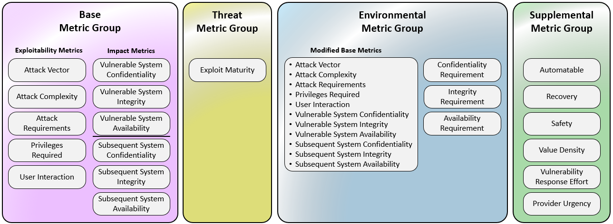

# CVSS 4.0

[Documentation officielle](https://www.first.org/cvss/v4.0/specification-document)

Publication officiel prévue fin octobre 2023

Nouvelle version 

L'objectif de cette nouvelle version est de clarifier certaines metric (SCOPE a été supprimé), d'elargir les metrics( sécurité des personnes )  et d'améliorer l'adoption en permettant aux clients de ponderer le score avec des metriques internes à l'organisation 

# Nouvelle  nomenclature pour identifier les combinaisons avec le score de base:

- CVSS-B: Score de Base 
- CVSS-BT: Base + Threat 
- CVSS-BE: Base + Environmental
- CVSS-BTE: Base + Threat + Environmental 

# Synthèse des groupes de metrique:

1. Groupe de métrique de Base

Nouvelles métriques:

- Attack Requirements (AT):Pré-requis à l'attaque 

 User Interaction(UI) : Interaction d'un utilisateur (None/Active/Passive)

- La metrique Scope a été supprimé  

- Les metriques d'impact ont été séparés en 2 groupes:

Seule une augmentation de l'accès, des privilèges obtenus ou d'autres résultats négatifs résultant d'une exploitation réussie doivent être pris en compte lors de l'évaluation des paramètres d'impact d'une vulnérabilité. Prenons l'exemple d'une vulnérabilité qui nécessite des autorisations en lecture seule avant de pouvoir l'exploiter. Après une exploitation réussie, l'attaquant conserve le même niveau d'accès en lecture et obtient un accès en écriture. Dans ce cas, seule la mesure de l'impact sur l'intégrité doit être évaluée, et les mesures de l'impact sur la confidentialité et la disponibilité doivent être définies comme nulles.

- Vulnerable System Confidentiality (VC), Integrity (VI), Availability (VA)

- Subsequent System(s) Confidentiality (SC), Integrity (SI), Availability (SA)

Exemple: Une vulnérabilité sur une base de données intégré à un haut-parleur intelligent affecte egalement le fonctionnement du haut parleur
Prise en compte des impacts en dehors du systeme vulnerable
Lorsqu'une vulnérabilité n'a pas d'impact en dehors du système vulnérable, les évaluateurs doivent laisser la valeur NONE (N) pour la mesure de l'impact sur le système ultérieur.

2. Menaces

**La temporalité de la vulnérabilité a été remplacé par le groupe de métrique concernant les menaces (Threat metrics group)**

- Exploit Maturity: Maturité de l'exploit

Cet indicateur mesure la probabilité que la vulnérabilité soit attaquée et se fonde sur l'état actuel des techniques d'exploitation, la disponibilité du code d'exploitation ou l'exploitation active "dans la nature".

3. Groupe de métrique environnemental

todo

4. Supplemental Metrics (metriques supplementaires)

todo 

Value Density (V):
La densité de valeur décrit les ressources sur lesquelles l'attaquant prendra le contrôle en un seul événement d'exploitation. Elle a deux valeurs possibles : diffuse et concentrée :

- Diffuse(D)

Le système qui contient le système vulnérable a des ressources limitées. 

En d'autres termes, les ressources sur lesquelles l'attaquant prendra le contrôle lors d'un seul événement d'exploitation sont relativement faibles. 

Un exemple de densité de valeur diffuse (pensez : limitée) serait une attaque sur la vulnérabilité d'un seul client de messagerie.

- Concentrated (C):

Le système qui contient le système vulnérable est riche en ressources. 

Ces systèmes sont souvent sous la responsabilité directe des "opérateurs de système/admin" plutôt que des utilisateurs. 

Un exemple de densité de valeur concentrée (pensez : large) serait une attaque sur un serveur de messagerie

# Synthèse: 

| Rating   | CVSS Score |
|----------|------------|
| None     | 0.0        |
| Low      | 0.1 - 3.9  |
| Medium   | 4.0 - 6.9  |
| High     | 7.0 - 8.9  |
| Critical | 9.0 - 10.0 |

# Calculette CVSS4

https://redhatproductsecurity.github.io/cvss-v4-calculator/#

