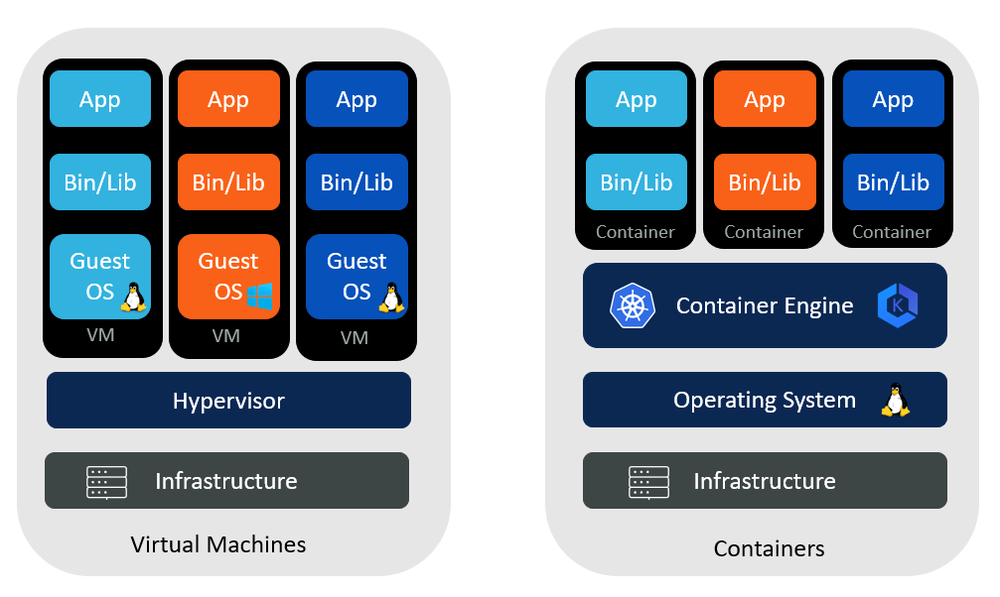

# 10 minutes docker 


[Doc officielle](https://docs.docker.com/get-started/resources/)

    sudo docker run -d 
       -v docker/nginx/default.conf:/etc/nginx/conf.d/default.conf 
       -v docker/nginx/index.html:/usr/share/html/:ro 
       -p 8080:80 nginx:latest 
       --name=nginx-lo  

---

# 1. VM & conteneur



---

- Une VM est un système d'exploitation complet avec son propre noyau, ses pilotes matériels, ses programmes et ses applications. Lancer une VM uniquement pour isoler une seule application représente une charge importante.

- Un conteneur est simplement un processus isolé contenant tous les fichiers nécessaires à son exécution. 

Si vous exécutez plusieurs conteneurs, ils partagent tous le même noyau, ce qui vous permet d'exécuter davantage d'applications sur une infrastructure réduite.

---

# 2. Images & conteneurs

Une image est un template en lecture seule avec des instructions pour créer un conteneur. 

Une image est souvent contruite à partir d'autres images avec quelques personalisations complémentaires

Exemple: Il est possible de créer une image basé sur Ubuntu qui installe un serveur Nginx , une application et les détails de configuration pour faire fonctionner l'application

Chaque conteneur necessite au prelalable une image pour être instancié

---

Ces images sont disponible sur des dépots(repositories) tel que: 

- [dockerhub](https://hub.docker.com/)

- [quay.io](https://quay.io/)

- ...

- ou localement 

__Commande pour télécharger (tirer) une image__:

```
podman pull docker.io/library/debian:stable-slim
```

---

Liste des images télechargées localement: ( **! aucun conteneur n'est instancié !** )

```
$ podman images
REPOSITORY                TAG          IMAGE ID      CREATED     SIZE
docker.io/library/debian  stable-slim  86f9b934c377  2 days ago  77.8 MB
``` 

---

# __Création d'un conteneur:__

```bash
podman run -d -t debian:stable-slim

```

si le conteneur a été créé correctement, un identifiant unique est généré:

61d1b10b5818f397c6fd8f1fc542a83810d21f81825bbfb9603b7d99f6322845

Commande pour lister les conteneurs:

```
docker ps -a ou docker container list

CONTAINER ID  IMAGE                                 COMMAND     CREATED         STATUS             PORTS       NAMES
61d1b10b5818  docker.io/library/debian:stable-slim  bash        44 seconds ago  Up 44 seconds ago              gallant_mahavira
```

# Autre facon pour créer un conteneur ( personnalisé ) :

Utilisation d'un fichier  Dockerfile : fichier contenant les instruction pour construire une image

Exemple de fichier  Dockerfile ( fichier yaml /yml : SYNTAXE !!):

```

# Utiliser l'image officielle NGINX comme base
FROM nginx:latest

# Définir le répertoire de travail
WORKDIR /usr/share/nginx/html

# Copier les fichiers locaux vers le conteneur
COPY . /usr/share/nginx/html

# Exposer le port 80 pour l'accès
EXPOSE 80

# Copier le fichier de configuration NGINX
COPY default /etc/nginx/sites-available/default
```

---

Explications des instructions :

- FROM nginx:latest : Utilise l'image officielle NGINX comme base.
- WORKDIR /usr/share/nginx/html : Définit le répertoire de travail pour les instructions suivantes.
- COPY . /usr/share/nginx/html : Copie les fichiers du répertoire local vers le répertoire de travail dans le conteneur.
- EXPOSE 80 : Indique que le conteneur écoutera sur le port 80.
- COPY default /etc/nginx/sites-available/default : Copie le fichier de configuration NGINX vers le répertoire approprié.

<u>Construction de l'image:</u>

Syntaxe:

    docker build [-t <tag:version>] [-f <chemin_du_dockerfile>] <contexte_de_construction>

Exemple: 

    docker build -t mynginx . ( ou docker build -t monginx -f dockerfile.yml)


Liste de instructions 

# 4. Création de **plusieurs conteneurs**

## Docker compose :

- Les fichiers docker-compose.yml ou compose.yaml définissent les services, réseaux et volumes de votre application.

- Relation avec Dockerfiles : Les fichiers Compose utilisent des images Docker, qui peuvent être construites à partir de Dockerfiles.

---

Exemple de fichier (fichier yaml /yml : SYNTAXE !!) :  **Un wordpress sur le port 80**

```
services:
  db:
    # We use a mariadb image which supports both amd64 & arm64 architecture
    image: mariadb:10.6.4-focal
    command: '--default-authentication-plugin=mysql_native_password'
    volumes:
      - db_data:/var/lib/mysql
    restart: always
    environment:
      - MYSQL_ROOT_PASSWORD=somewordpress
      - MYSQL_DATABASE=wordpress
      - MYSQL_USER=wordpress
      - MYSQL_PASSWORD=wordpress
    expose:
      - 3306
      - 33060
  wordpress:
    image: wordpress:latest
    ports:
      - 80:80
    restart: always
    environment:
      - WORDPRESS_DB_HOST=db
      - WORDPRESS_DB_USER=wordpress
      - WORDPRESS_DB_PASSWORD=wordpress
      - WORDPRESS_DB_NAME=wordpress
volumes:
  db_data:
```

---

Création des conteneurs:

    docker compose up -d  -f *compose_file.yml*

Arrêter et supprimer les conteneurs:

    docker compose down  (arrêt et suppression du conteneur)

    docker compose stop *Container_Id*/*service*  (arrêt du conteneur)

    docker compose start *Container_Id*/*service*  (démarrage du conteneur)

( Voir TP)

# 5. Dockerfile & Docker compose  (Notion de context)

Un fichier Dockerfile fournit des instructions pour créer une image de conteneur, tandis qu'un fichier Compose définit vos conteneurs en cours d'exécution. 

Un fichier Compose fait référence à un fichier Dockerfile pour créer une image à utiliser pour un service particulier.

    services:
      web:
        build:
          context: .
          dockerfile: Dockerfile

context: définit le répertoire qui sera utilisé pour construire l'image. 
. indique le répertoire courant 

dockerfile (optionnel) : Specifie le nom du Dockerfile dans le context (répertoire)


# 6.  Notion Réseaux ( -p / -P)

Chaque composant s'exécute dans son propre environnement sandbox, complètement isolé de tout le reste sur votre machine hôte. 
Cette isolation est excellente pour la sécurité et la gestion des dépendances, mais cela signifie également que vous ne pouvez pas y accéder directement.

Par exemple, vous ne pouvez pas accéder à l'application web dans votre navigateur.

D'ou la notion de publication de port  et s'effectue à la creation du conteneur avec le flag -p (ou --publish) avec docker run

Syntaxe: 

    docker run -d -p HOST_PORT:CONTAINER_PORT nginx

HOST_PORT : numéro de port sur votre machine hôte où vous souhaitez recevoir le trafic

CONTAINER_PORT : numéro de port dans le conteneur qui écoute les connexions


Exemple: 

    docker run -d -p 8080:80 docker/welcome-to-docker

Tout le trafic envoyé au port 8080 de la machine hôte sera transféré vers le port 80 du conteneur.

<u>Variantes:</u>

**Port éphémère**: 


    docker run -p 80 nginx

    docker ps
    CONTAINER ID   IMAGE         COMMAND                  CREATED          STATUS          PORTS                    NAMES
    a527355c9c53   nginx         "/docker-entrypoint.…"   4 seconds ago    Up 3 seconds    0.0.0.0:54772->80/tcp    romantic_williamson


**Publication de  tous les ports**:

    docker run -P nginx

La commande ci-dessus publiera tous les ports exposés configurés par l'image


# 7. Notion  de Volumes (-v ou --mount): 

[host-path]:[container-path]:[rw|ro]

rw: par defaut

__Syntaxe obsolète__ ( toujours utilisé par soucis de simplification )

-v /path/on/host:/path/in/container syntax is the "old" syntax

__Syntax moderne__: 

--mount type=bind,source=/path/on/host,target=/path/in/container

--mount  est plus explicite, mais  -v est plus rapide à écrire

--mount supporte tous les type de montage ; -v ne supporte pas les montages de type tmpfs 

--mount échoue si le chemin n'existe pas; -v  créé le chemin 


    docker run --mount=type=bind,source=$(pwd),target=/src -dP namer


#  Timeout (> 10 min)

ENTRYPOINT et CMD sont des commandes similaires dans Dockerfile. 
Utiliser seules ou combinées à la fin du Dockerfile 

- ENTRYPOINT définit le commande principale au lancement du conteneur. 

A utiliser  lorsque le conteneur est conçu pour une tâche fixe (ex : exécuter un script ou un binaire). 

- CMD fournit les arguments par défaut à cette commande.

A utiliser pour permettre aux utilisateurs de remplacer le comportement par défaut.

CMD: 

elle permet de préciser la commande par défaut lancée à la création d'une instance du conteneur avec docker run. 

On l'utilise avec une liste de paramètres

    CMD ["echo 'Conteneur démarré'"]

ENTRYPOINT: 

Précise le programme de base (le "prompt") avec lequel sera lancé la commande

    FROM python:3.12
    ENTRYPOINT ["/usr/bin/python3"]

Ensuite on peut appeler : 

    docker run python_entrypoint -c 'print("hello")'


Si ENTRYPOINT et CMD sont definies : CMD fournit des arguments par defaut pour ENTRYPOINT

    ENTRYPOINT ["date"]
    CMD ["+%A"]

Au demarrage (run), la commande date +%A sera executé. Il est possible de modifier +%A par +%B 

# Quelques commandes utiles 

    docker exec -it *conteneur_name* bash 

-> Execution d'un shell bash interactif 
La commande "ctrl c"  stoppe le conteneur ( docker compose start *nom_conteneur* )
"ctrl p q" pour sortir du conteneur sans l'arreter


    docker ps    # affiche les conteneurs en train de tourner
    docker ps -a # affiche  également les conteneurs arrêtés
    docker logs mycontainer  # visualiser les logs du conteneur
    docker stop <nom_ou_id_conteneur> # ne détruit pas le conteneur
    docker start <nom_ou_id_conteneur> # le conteneur a déjà été créé
    docker image history python:3.12 #  Historique de construction d'une image
    docker inspect <container_id_or_name>  # Information sur un conteneur

# Bonus:

Convertisseur de commande docker run  en fichier docker-compose.yml:

[comporize.com](https://www.composerize.com/)

