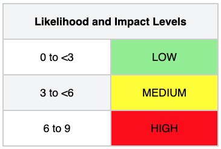
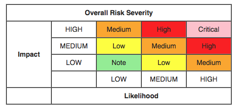

# Méthodologie d'évaluation des risques OWASP

Objectifs d'une Méthodologie d'évaluation des risques:

La mise en place d'un système d'évaluation des risques permet de gagner du temps et d'éviter les discussions sur les priorités. 

Ce système permettra de s'assurer que l'entreprise ne se laisse pas distraire par des risques mineurs tout en ignorant des risques plus graves qui sont moins bien compris.

Calculette en ligne : 

[https://owasp-risk-rating.com/](https://owasp-risk-rating.com/)

## Différentes méthodes:

- Classic Risk Rating: This risk rating methodology uses a Likelihood value and an Impact value with a mathematical formula applied to come up with a risk score.  Typically something like Risk = Likelihood x Impact.  I talk more about this risk scoring methodology in my Normalizing Risk Scores Across Different Methodologies blog post.

- CVSS: Also known as the Common Vulnerability Scoring System, CVSS is developed by the Forum of Incident Response and Security Teams (FIRST) organization and is what is used to rate all of the Common Vulnerabilities and Exposures (CVEs) found in the National Vulnerability Database (NVD).  It is comprised of a Base Vector, which has multiple values to estimate likelihood and impact, along with optional values to estimate the Temporal and Environmental impact on your environment.

- DREAD: The DREAD risk assessment model was initially used at Microsoft as a simple mnemonic to rate security threats on the basis of Damage, Reproducibility, Exploitability, Affected Users, and Discoverability.  We don't see it being used by customers very often, but it has been included in SimpleRisk since very early on in our product history.

- OWASP: The OWASP Risk Rating Methodology was created by Jeff Williams, one of the Founders of the OWASP organization, as a means to easily and more accurately assess the likelihood and impact of a web application vulnerability.  It's an application-centric play on the Classic Risk Rating described above, where the Likelihood is assessed based on Threat Agent and Vulnerability factors and the Impact is assessed based on Technical and Business factors.

### Approche standard:

Modele de risque standard: 

**Risk = Likelihood * Impact** 

<ins>En francais</ins> :  
Risque = la probabilité d'exploitation d'une vulnerabilité * impacte sur le SI ou le business

La "probabilité" et "l'impact" sont décomposées pour déterminer ces facteurs de risque

**<ins>Etapes</ins>**: 

  1: Identifier un risque

  2: Facteurs d'estimation de la probabilité

  3: Facteurs d'estimation de l'impact

  4: Determiner la sévérité du risque

  5: Prioriser les remédiations

  6: Personnaliser votre modèle de risque

#### 1. Identification des risques:

Le testeur doit rassembler des informations sur l'agent de menace concerné, l'attaque qui sera utilisée, la vulnérabilité impliquée et l'impact d'une exploitation réussie sur l'entreprise. 

Il peut y avoir plusieurs groupes d'attaquants possibles, ou même plusieurs impacts possibles sur l'entreprise.

En général, il est préférable de pécher par excès de prudence en choisissant l'option la plus défavorable, car c'est celle qui présente le risque global le plus élevé.

#### 2. Facteurs d'estimation de la probabilité 

Au niveau le plus élevé, il s'agit d'une mesure approximative de la probabilité que cette vulnérabilité particulière soit découverte et exploitée par un attaquant.

Il n'est pas nécessaire d'être très précis sur cette estimation  
Les niveaux "low", "medium" ou "high" sont suffisant

Un certain nombre de facteurs peuvent aider à déterminer la probabilité. La première série de facteurs est liée à l'agent de menace (Threat Agent) concerné. 

L'objectif est d'estimer la probabilité d'une attaque réussie à partir d'un groupe d'attaquants possibles.

**Chaque facteur comporte une série d'option et chaque option est associée à une note de probabilité de 0 à 9 utilisées par la suite pour estimer une probabilité globale.**

##### a) Agent de Menace ( Threat Agent ):

L'objectif est d'estimer la probabilité d'une attaque réussie par ce groupe d'agents de menace. Utilisez l'agent de menace le plus défavorable.

- Niveau de compétence(skill level): Quel est le niveau de compétence technique de ce groupe d'agents de menace ? 
    
    Aucune compétence technique (1), quelques compétences techniques (3), utilisateur avancé d'ordinateur (5), compétences en réseau et en programmation (6), compétences en matière de pénétration de la sécurité (9)

- Motivation (Motive): Quelle est la motivation de ce groupe d'agents de menace pour trouver et exploiter cette vulnérabilité ?

    Récompense faible ou nulle (1), récompense possible (4), récompense élevée (9)

- Opportunité(Opportunity): Quelles sont les ressources et les opportunités nécessaires à ce groupe d'agents de lutte contre les menaces pour trouver et exploiter cette vulnérabilité ?

    Accès total ou ressources coûteuses nécessaires (0), accès ou ressources spéciales nécessaires (4), accès ou ressources partiels nécessaires (7), aucun accès ou ressources nécessaires (9).

- Taille: Quelle est la taille de ce groupe d'agents de menace ?

    Développeurs (2), administrateurs système (2), utilisateurs de l'intranet (4), partenaires (5), utilisateurs authentifiés (6), utilisateurs anonymes de l'internet (9)

##### b) Facteurs de vulnérabilité:
L'objectif est d'estimer la probabilité que la vulnérabilité en question soit découverte et exploitée

- Facilité de découverte: Dans quelle mesure est-il facile pour ce groupe d'agents de découvrir cette vulnérabilité ? 

    Pratiquement impossible (1), difficile (3), facile (7), outils automatisés disponibles (9)

- Facilité d'exploitation: Dans quelle mesure est-il facile pour ce groupe d'agents de menace d'exploiter cette vulnérabilité ?

    Théorique (1), difficile (3), facile (5), outils automatisés disponibles (9)

- Niveau de diffusion (awareness) : Dans quelle mesure cette vulnérabilité est-elle connue de ce groupe d'agents de menace ?

    Inconnue (1), cachée (4), évidente (6), connue du public (9)

- Détection des intrusions: Quelle est la probabilité qu'un exploit soit détecté ?

    Détection active dans l'application (1), enregistrée et examinée (3), enregistrée sans examen (8), non enregistrée (9)

#### 3. Facteur d'estimation de l'impact

2 types d'impact : Technique et business 

L'impact sur l'entreprise est généralement le plus important.

Toutefois, il se peut que vous n'ayez pas accès à toutes les informations nécessaires pour déterminer les conséquences commerciales d'un exploit réussi. 

Dans ce cas, le fait de fournir autant de détails que possible sur le risque technique permettra au représentant approprié de l'entreprise de prendre une décision sur le risque commercial.

**Là encore, chaque facteur est assorti d'une série d'options et chaque option est associée à une note d'impact de 0 à 9 qui sera utiliser plus tard pour estimer l'impact global.**

##### a) Impact techniques:

L'objectif est d'estimer l'ampleur de l'impact sur le système en cas d'exploitation de la vulnérabilité.

- Perte de confidentialité: Quelle quantité de données pourrait être divulguée et quel est leur degré de sensibilité ?

    Divulgation d'un minimum de données non sensibles (2), divulgation d'un minimum de données critiques (6), divulgation d'un grand nombre de données non sensibles (6), divulgation d'un grand nombre de données critiques (7), divulgation de toutes les données (9).

- Perte d'intégrité: Quelle est la quantité de données susceptibles d'être corrompues et à quel point sont-elles endommagées ?

    Données minimales légèrement corrompues (1), données minimales gravement corrompues (3), données étendues légèrement corrompues (5), données étendues gravement corrompues (7), toutes les données totalement corrompues (9).

- Perte de disponibilité: Quelle quantité de service pourrait être perdue et quelle est son importance vitale ?

    Interruption minimale des services secondaires (1), interruption minimale des services primaires (5), interruption importante des services secondaires (5), interruption importante des services primaires (7), perte totale de tous les services (9).

- Traçabilité: Les actions des agents de menace peuvent-elles être rattachées à une personne ?

    Entièrement traçable (1), éventuellement traçable (7), complètement anonyme (9)

##### b) Impact business: 

Le risque business justifie les investissement dans la résolution des problèmes de sécurité.

- Préjudice financier: Quel est le préjudice financier résultant d'un exploit ? 

    Moins que le coût de la correction de la vulnérabilité (1), effet mineur sur le bénéfice annuel (3), effet important sur le bénéfice annuel (7), faillite (9).

- Atteinte à la réputation: Un exploit entraînerait-il une atteinte à la réputation qui nuirait à l'entreprise ? 

    Dommage minime (1), perte de grands comptes (4), perte de clientèle (5), atteinte à la marque (9).

- Non-conformité: Quel est le degré d'exposition à la non-conformité ?

   Violation mineure (2), violation manifeste (5), violation très médiatisée (7)

- atteinte à la vie privée: Quelle quantité de données personnels pourrait être divulguée ?

    Une personne (3), des centaines de personnes (5), des milliers de personnes (7), des millions de personnes (9).

#### 4. Déterminer la sévérité du risque

Dans cette étape, l'estimation de la probabilité et l'estimation de l'impact sont réunies pour calculer la gravité globale de ce risque. 

L'échelle de 0 à 9 est divisée en trois parties

Utilisation des scores de probabilité 

<table>
<tbody><tr>
<td colspan="4" align="center">Threat agent factors</td>
<td></td>
<td colspan="4" align="center">Vulnerability factors</td>
</tr>
<tr>
<td width="10%" align="center">Skill level</td>
<td width="10%" align="center">Motive</td>
<td width="10%" align="center">Opportunity</td>
<td width="10%" align="center">Size</td>
<td width="2%" align="center"></td>
<td width="10%" align="center">Ease of discovery</td>
<td width="10%" align="center">Ease of exploit</td>
<td width="10%" align="center">Awareness</td>
<td width="10%" align="center">Intrusion detection</td>
</tr>
<tr>
<td align="center">5</td>
<td align="center">2</td>
<td align="center">7</td>
<td align="center">1</td>
<td align="center"></td>
<td align="center">3</td>
<td align="center">6</td>
<td align="center">9</td>
<td align="center">2</td>
</tr>
<tr>
<td colspan="9" bgcolor="lightblue" align="center">Overall likelihood=4.375 (MEDIUM)</td>
</tr>
</tbody>
</table>

Ensuite, le testeur doit déterminer l'impact global.
Le processus est similaire ici. 

Dans de nombreux cas, la réponse sera évidente, mais le testeur peut faire une estimation basée sur les facteurs, ou il peut faire la moyenne des scores pour chacun des facteurs.  
Encore une fois, moins de 3 est faible, 3 à moins de 6 est moyen, et 6 à 9 est élevé. 

Par exemple :

<table cellspacing="0" cellpadding="5" border="1" align="center">
<tbody><tr>
<th colspan="4" align="center">Technical Impact</th>
<td></td>
<th colspan="4" align="center">Business Impact</th>
</tr>
<tr>
<td width="10%" align="center">Loss of confidentiality</td>
<td width="10%" align="center">Loss of integrity</td>
<td width="10%" align="center">Loss of availability</td>
<td width="10%" align="center">Loss of accountability</td>
<td width="2%" align="center"></td>
<td width="10%" align="center">Financial damage</td>
<td width="10%" align="center">Reputation damage</td>
<td width="10%" align="center">Non-compliance</td>
<td width="10%" align="center">Privacy violation</td>
</tr>
<tr>
<td align="center">9</td>
<td align="center">7</td>
<td align="center">5</td>
<td align="center">8</td>
<td align="center"></td>
<td align="center">1</td>
<td align="center">2</td>
<td align="center">1</td>
<td align="center">5</td>
</tr>
<tr>
<td colspan="4" bgcolor="lightblue" align="center">Overall technical impact=7.25 (HIGH)</td>
<td></td>
<td colspan="4" bgcolor="lightblue" align="center">Overall business impact=2.25 (LOW)</td>
</tr>
</tbody></table>

**Determiner la sévérité** 

Quel que soit le résultat des estimations de probabilité et d'impact, le testeur peut maintenant les combiner pour obtenir une évaluation finale de la gravité de ce risque. 

Il est à noter que s'il dispose de bonnes informations sur l'impact commercial, il doit les utiliser à la place des informations sur l'impact technique. 

En revanche, s'il ne dispose d'aucune information sur l'entreprise, il doit se contenter de l'impact technique.

Dans l'exemple précédent, la probabilité est moyenne et l'impact technique est élevé, de sorte que, d'un point de vue purement technique, il semble que la gravité globale soit élevée.  
Toutefois, il convient de noter que l'impact commercial est en fait faible, de sorte que la gravité globale est également décrite comme faible.

C'est pourquoi il est essentiel de comprendre le contexte commercial des vulnérabilités que vous évaluez pour prendre de bonnes décisions en matière de risque.  
Ne pas comprendre ce contexte peut conduire à un manque de confiance entre l'entreprise et les équipes de sécurité, comme c'est le cas dans de nombreuses organisations.

#### 5. Prioriser les remédiations 

Une fois les risques classifiées par ordre de priorités, les risques les plus graves doivent être corrigés en premier.

Tous les risques ne valent pas la peine d'être corrigés et que certaines pertes sont non seulement prévisibles, mais aussi justifiables en fonction du coût de la correction du problème. 

Par exemple, si la mise en œuvre de contrôles permettant d'endiguer une fraude de 2 000 dollars par an coûte 100 000 dollars, il faudra 50 ans de retour sur investissement pour éradiquer la perte. 

Cependant la fraude peut nuire à la réputation de l'organisation, ce qui pourrait lui coûter beaucoup plus cher.

#### 6. Personnaliser votre modèle de risque

Un modèle personnaliser pour un domaine métier facilite l'adoption et produit de meilleur résultat.  
Les risques sont mieux compris par les parties prenantes et évite les discussions inutiles sur la méthode de calcul. 

- Ajout de facteurs 

Le testeur peut choisir différents facteurs qui représentent mieux ce qui est important pour l'organisation spécifique.

Par exemple, une application militaire peut ajouter des facteurs d'impact liés à la perte de vies humaines ou d'informations classifiées.  
Le testeur peut également ajouter des facteurs de probabilité, tels que la fenêtre d'opportunité pour un attaquant ou la force de l'algorithme de chiffrement.

- Personnaliser les options :

Des exemples d'options sont associés à chaque facteur, mais le modèle sera beaucoup plus efficace si le testeur adapte ces options à l'entreprise. 

Par exemple, utilisez les noms des différentes équipes et les noms de l'entreprise pour les différentes classifications des informations.  
Le testeur peut également modifier les scores associés aux options. La meilleure façon d'identifier les bonnes notes est de comparer les notes produites par le modèle avec les notes produites par une équipe d'experts.  
Vous pouvez mettre au point le modèle en ajustant soigneusement les notes pour qu'elles correspondent.

- Pondération des facteurs

Le modèle ci-dessus part du principe que tous les facteurs ont la même importance.  
Vous pouvez pondérer les facteurs pour mettre l'accent sur ceux qui sont les plus importants pour l'entreprise concerné.  
Cela rend le modèle un peu plus complexe, car le testeur doit utiliser une moyenne pondérée. Mais pour le reste, tout fonctionne de la même manière.  
Là encore, il est possible d'affiner le modèle en le comparant à des évaluations de risques que l'entreprise considère comme exactes.
